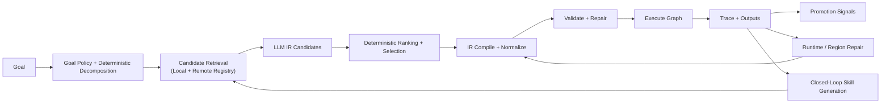

# Graphsmith

**AI-native planning and execution for graph-based programs.**

Graphsmith turns natural language goals into typed executable graphs. An LLM
plans semantic intent; Graphsmith compiles, validates, repairs, executes, and
learns reusable skills from the result.

It is no longer just a text-pipeline planner. The current architecture supports
typed IR planning, guarded execution, bounded loop lowering, local structural
repair, closed-loop skill generation, skill promotion, and both local and
remote skill registries.

## Core idea



The LLM does not emit raw graph edges as the primary interface. It proposes
semantic structure in IR, and Graphsmith handles graph mechanics,
normalization, validation, and bounded repair deterministically.

## What Graphsmith does now

1. **Plans in a typed IR**
   Goals become structured plans with steps, bindings, loop blocks, and
   guarded execution hints.
2. **Compiles deterministically**
   IR is lowered into executable graphs with explicit nodes, edges, outputs,
   and validation.
3. **Repairs locally**
   Graphsmith can normalize bad outputs, patch certain local contract issues,
   and regenerate failing regions instead of always replanning everything.
4. **Executes and traces**
   The runtime records node-level traces, skipped branches, loop iterations,
   and failures for inspection and repair.
5. **Generates missing skills**
   For bounded capability gaps, Graphsmith can generate, validate, publish, and
   reuse a new skill inside the same planning loop.
6. **Promotes useful structure**
   Repeated trace patterns can be surfaced as promotion candidates for reuse.
7. **Uses local and remote registries**
   Skills can be published locally or fetched from a hosted remote registry
   with provenance metadata.

## Current capability envelope

- Deterministic and LLM-backed text/JSON pipelines
- Structural branches with guarded execution
- Bounded loop lowering and execution
- Closed-loop single-skill generation with repair-aware re-entry
- Local subgraph regeneration and runtime-trace-guided region repair
- Promotion mining from traces
- Local registry, file-backed remote mock, and hosted HTTP remote registry
- Frontier and stress harnesses for probing generalization boundaries

What it is **not** yet:

- a general programming language runtime
- a general code-editing agent by default
- a system that can yet synthesize arbitrary multi-region programs reliably

## Quickstart

```bash
# Install
pip install -e ".[dev]"

# Create a .env file with API keys (gitignored)
cp .env.example .env

# Publish example skills to a local registry
REG=$(mktemp -d)
for d in examples/skills/*/; do graphsmith publish "$d" --registry "$REG"; done

# Plan
graphsmith plan "normalize text and count words" \
  --registry "$REG" \
  --backend ir \
  --provider anthropic \
  --model claude-haiku-4-5-20251001

# Closed-loop solve
graphsmith solve "compute the median of numbers" --auto-approve
```

## Hosted remote registry

Graphsmith now also supports a hosted remote registry flow.

```bash
# Search remote skills
graphsmith search count \
  --remote-registry https://graphsmith-remote-registry.graphsmith.workers.dev

# Publish to a remote registry
export GRAPHSMITH_REMOTE_TOKEN=...
graphsmith remote-publish examples/skills/text.word_count.v1 \
  --remote-registry https://graphsmith-remote-registry.graphsmith.workers.dev
```

The current remote setup is still an early foundation:
- immutable packages
- search/fetch/publish
- local cache
- provenance metadata

Trust-aware ranking, moderation, and richer quality policy are still future work.

## Recommended planner configuration

```bash
graphsmith eval-planner \
  --backend ir \
  --ir-candidates 3 \
  --decompose \
  --provider anthropic \
  --model claude-haiku-4-5-20251001 \
  --goals evaluation/goals \
  --registry "$REG"
```

| Flag | Purpose |
|------|---------|
| `--backend ir` | Use IR planning and deterministic compilation |
| `--ir-candidates 3` | Generate multiple candidates and rerank them |
| `--decompose` | Add deterministic semantic decomposition |
| `--provider ...` | Use a live provider for planning |
| `--registry` / `--remote-registry` | Search local and/or remote skills |

## Project structure

```text
graphsmith/
  planner/          IR planning, decomposition, compiler, repair, policy
  models/           Pydantic graph / package / planner models
  validator/        Deterministic graph + package validation
  runtime/          Execution engine, guards, loops, traces
  ops/              Primitive ops and provider-backed execution
  registry/         Local, aggregate, file-backed remote, HTTP client
  skills/           Closed-loop skill generation and autogen templates
  traces/           Trace storage and promotion mining
  evaluation/       Frontier, stress, and planner evaluation harnesses
  cli/              Typer CLI
examples/skills/    Example reusable skill packages
evaluation/         Goal suites for planner, frontier, and stress testing
docs/               Architecture notes and sprint docs
tests/              Automated regression coverage
cloudflare/         Hosted remote registry worker scaffold
```

## Important CLI commands

| Command | Description |
|---------|-------------|
| `plan` | Generate a plan from a natural language goal |
| `plan-and-run` | Plan and execute in one step |
| `run-plan` | Run a saved plan |
| `solve` | Run the bounded closed-loop generation path |
| `publish` | Publish a skill to a local registry |
| `remote-publish` | Publish a skill to a remote registry |
| `search` / `show` | Search or inspect local/remote skills |
| `eval-planner` | Planner evaluation on goal sets |
| `eval-frontier` | Structural frontier evaluation |
| `eval-stress-frontier` | Isolated vs cumulative stress runs |
| `promote-candidates` | Surface promotion opportunities from traces |

Run `graphsmith --help` for the full list.

## Providers

```bash
# Anthropic
export GRAPHSMITH_ANTHROPIC_API_KEY=sk-ant-...

# Groq / OpenAI-compatible
export GRAPHSMITH_GROQ_API_KEY=gsk_...
graphsmith eval-frontier \
  --provider openai \
  --model llama-3.1-8b-instant \
  --base-url https://api.groq.com/openai/v1
```

Or create a `.env` file:

```text
GRAPHSMITH_ANTHROPIC_API_KEY=sk-ant-...
GRAPHSMITH_GROQ_API_KEY=gsk_...
GRAPHSMITH_REMOTE_TOKEN=...
```

## Testing

```bash
pytest
pytest -v
pytest -x
```

For live runs, use the evaluation harnesses:

```bash
graphsmith eval-frontier --goals evaluation/frontier_goals --registry "$REG" ...
graphsmith eval-stress-frontier --goals evaluation/stress_frontier_goals --registry "$REG" ...
```

## Documentation

- [IR architecture](docs/PLANNING_IR_ARCHITECTURE.md)
- [Closed-loop generation](docs/CLOSED_LOOP_SKILL_GENERATION.md)
- [Remote registry foundation](docs/REMOTE_SKILL_REGISTRY_FOUNDATION.md)
- [Remote registry v1 design](docs/REMOTE_SKILL_REGISTRY_V1_DESIGN.md)
- [Cloudflare remote registry](docs/CLOUDFLARE_REMOTE_REGISTRY.md)
- [Running evals](docs/RUNNING_EVALS.md)
- [Debugging and traces](docs/DEBUGGING_AND_TRACES.md)
- [Why Graphsmith](docs/WHY_GRAPHSMITH.md)
- [Changelog](CHANGELOG.md)

## Roadmap summary

Graphsmith now has a strong programmable planning substrate, but true
general-purpose coding still requires a few major leaps:

1. **Graph-native skill synthesis**
   Generated skills need to become small subgraphs with contracts and tests,
   not mostly single-step templates.
2. **Region-level repair**
   Failing loops, branches, and subplans need local regeneration as a normal
   workflow, not an edge case.
3. **Richer runtime semantics**
   More explicit bindings, structured errors, state/effects, and reusable
   subgraphs are needed to move from workflows toward real programs.
4. **Tool and code environment integration**
   Files, tests, shell commands, APIs, and code edits need to become first-class
   skill environments so Graphsmith can tackle real software tasks.
5. **Trust-aware skill reuse**
   Remote skill reuse should eventually depend on provenance, validation
   history, and policy, not just retrieval.

The short version: Graphsmith is already a serious experimental substrate for
AI-native program planning, but the next phase is about generalized synthesis
and repair rather than adding more domain-specific tricks.

## License

[MIT](LICENSE)
