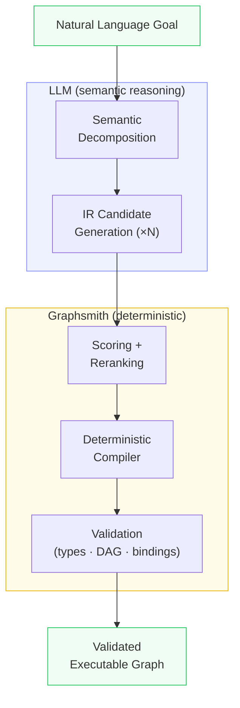

# Graphsmith

**Semantic planner + compiler for graph-based AI workflows.**

Graphsmith composes typed, executable skill graphs from natural language goals.
An LLM plans *what* to do; Graphsmith deterministically compiles *how* to wire it.

Claude Haiku: **36/36 (100%)** on benchmark + holdout + challenge.
Llama 3.1 8B: **~86-94%** with reranking + decomposition.

No public servers. Everything runs locally.

## How it works



1. **Decomposition** — LLM classifies the goal into content transforms + presentation intent
2. **IR generation** — LLM produces N candidate plans as semantic IR (steps, data flow, config)
3. **Scoring** — deterministic semantic scorer ranks candidates
4. **Compilation** — compiler lowers IR to executable graph (edges, node IDs, outputs)
5. **Validation** — structural checks (types, DAG, bindings) before execution

The LLM never serializes raw graph structures. It only describes semantic intent.
The compiler handles all graph mechanics deterministically.

## Current capabilities

- **Text pipelines**: normalize, summarize, extract keywords, title case, word count, sentiment
- **JSON extraction**: reshape, extract field
- **Formatting**: join lines (lists), template rendering (headers), prefix lines
- **Multi-step workflows**: chains, fan-out, multi-output goals
- **15 skills**, 36 evaluation goals across 3 test sets

## Quickstart

```bash
git clone https://github.com/jonaselgammal/Graphsmith.git
cd Graphsmith

# Install (creates .venv, installs deps, sets up .env)
./scripts/install.sh

# Activate and verify
source .venv/bin/activate
graphsmith doctor

# Add your API key to .env, then:
graphsmith run-interactive
```

### Manual install

```bash
pip install -e ".[dev]"
cp .env.example .env
# Edit .env: GRAPHSMITH_ANTHROPIC_API_KEY=sk-ant-...
```

### Run evaluation

```bash
REG=$(mktemp -d)
for d in examples/skills/*/; do graphsmith publish "$d" --registry "$REG" 2>/dev/null; done

graphsmith eval-planner --goals evaluation/goals --registry "$REG" \
  --backend ir --ir-candidates 3 --decompose \
  --provider anthropic --model claude-haiku-4-5-20251001 --delay 2
```

## Recommended configuration

```bash
graphsmith eval-planner \
  --backend ir \
  --ir-candidates 3 \
  --decompose \
  --provider anthropic \
  --model claude-haiku-4-5-20251001 \
  --goals evaluation/goals \
  --registry "$REG"
```

| Flag | Purpose |
|------|---------|
| `--backend ir` | Use IR pipeline (LLM → IR → compile), not raw graph emission |
| `--ir-candidates 3` | Generate 3 candidates, pick best via semantic scoring |
| `--decompose` | Add decomposition stage for semantic grounding |
| `--provider anthropic` | Use Anthropic API |
| `--model claude-haiku-4-5-20251001` | Fast, capable model |

## Performance

| Set | Goals | Claude Haiku | Llama 3.1 8B |
|-----|-------|-------------|--------------|
| Benchmark | 9 | 9/9 (100%) | 8-9/9 |
| Holdout | 15 | 15/15 (100%) | 12-14/15 |
| Challenge | 12 | 12/12 (100%) | 10-12/12 |
| **Total** | **36** | **36/36 (100%)** | **~31-34/36 (86-94%)** |

Stability on Llama 3.1 8B (3 runs): 28/36 goals always pass, 0 always fail,
8 intermittent (output naming noise).

## Interactive mode

```bash
graphsmith run-interactive
```

Plan workflows interactively. Type a goal, inspect candidates, compare alternatives:

```
  Graphsmith Interactive
  Provider: anthropic | Model: claude-haiku-4-5-20251001
  Backend: IR (3 candidates, decomposition: on)
  Type :help for commands

  > extract keywords from this text

  Planning...

  Plan Summary
  ----------------------------------------
  Steps:
    1. extract (text.extract_keywords.v1)
  Outputs:
    - keywords <- extract.keywords
  Effects: llm_inference

  (3 candidates compiled, :candidates to inspect, :compare to diff)

  > :candidates

  Candidate 1: ✔ SELECTED
    steps: extract
    outputs: keywords
    score: 115

  Candidate 2:
    steps: extract → format
    outputs: joined
    score: 80

  > :compare

  Selected (Candidate 1)
    steps: extract
    score: 115

  Alternative (Candidate 2)
    steps: extract → format
    score: 80

  Differences:
    alternative has: text.join_lines.v1
    score delta: +35
```

Commands: `:help`, `:candidates`, `:compare`, `:decomposition`, `:rerun`, `:history`, `:quit`.

## Project structure

```
graphsmith/
  planner/          IR pipeline: decomposition, prompt, parser, compiler, scorer
  models/           Pydantic models (SkillGraph, GlueGraph, GraphBody)
  validator/        Deterministic validation (types, DAG, bindings)
  runtime/          Topological executor + value store
  ops/              Primitive ops + LLM providers (Anthropic, OpenAI-compatible)
  registry/         Local skill registry (publish, search, fetch)
  evaluation/       Eval harness, stability analysis, candidate dataset
  cli/              Typer CLI (20+ commands)
  traces/           Execution trace persistence + promotion mining
examples/skills/    21 skill packages (text, math, JSON)
evaluation/         36 eval goals (benchmark + holdout + challenge)
scripts/            Eval runners, analysis tools, data collection
tests/              922 tests
docs/               Architecture and sprint documentation
```

## CLI commands

| Command | Description |
|---------|-------------|
| `eval-planner` | Evaluate planner quality against goal sets |
| `plan` | Generate a plan from a natural language goal |
| `plan-and-run` | Plan + execute in one step |
| `run-plan` | Run a saved plan |
| `run` | Run a skill package directly |
| `publish` | Publish a skill to the local registry |
| `search` | Search published skills |
| `validate` | Validate a skill package |
| `create-skill` | Generate a new skill scaffold |
| `solve` | Plan with closed-loop missing-skill generation |
| `doctor` | Check system readiness |
| `ui` | Launch local plan inspector (browser) |
| `version` | Print version |

Run `graphsmith --help` for the full list.

## Skills

Graphsmith includes 21 built-in skills across text, math, and JSON categories.

Create new skills with:
```bash
graphsmith create-skill my_domain.my_op.v1
```

This generates a complete scaffold (skill.yaml, graph.yaml, examples.yaml).

Or auto-generate a complete skill from a description:
```bash
graphsmith create-skill-from-goal "uppercase text"
# → generates implementation + validates + runs tests
```

See [docs/SKILLS.md](docs/SKILLS.md) for the full guide and
[docs/AUTO_SKILL_CREATION.md](docs/AUTO_SKILL_CREATION.md) for auto-generation.

## LLM providers

```bash
# Anthropic (recommended)
export GRAPHSMITH_ANTHROPIC_API_KEY=sk-ant-...

# Groq / OpenAI-compatible
export GRAPHSMITH_GROQ_API_KEY=gsk_...
graphsmith eval-planner --provider openai --model llama-3.1-8b-instant \
  --base-url https://api.groq.com/openai/v1
```

Or create a `.env` file (gitignored):
```
GRAPHSMITH_ANTHROPIC_API_KEY=sk-ant-...
GRAPHSMITH_GROQ_API_KEY=gsk_...
```

## Testing

```bash
pytest              # 970 tests, no network required
pytest -v           # verbose
pytest -x           # stop on first failure
```

## Status and roadmap

**v1 (current)**: architecture stable, 36/36 on Claude Haiku.

| Component | Status |
|-----------|--------|
| IR compiler | Stable |
| Deterministic scorer | Stable |
| Decomposition | Stable |
| Candidate reranking | Stable |
| Stability measurement | Complete |
| Candidate dataset pipeline | Complete |
| Learned reranker | Prototype (no headroom on Claude) |

**Next steps**:
- Weak-model optimization (Llama 3.1 8B)
- Learned reranker (when Llama data shows headroom)
- Broader skill/goal coverage

## Documentation

- **[Full Documentation](docs/index.md)** — getting started, CLI, skills, architecture
- [Getting Started](docs/getting_started.md) — install and first run
- [CLI Reference](docs/cli.md) — all commands and flags
- [Skills Guide](docs/SKILLS.md) — built-in skills and how to create new ones
- [Architecture](docs/architecture.md) — how the system works
- [Examples](docs/examples.md) — end-to-end usage patterns
- [Evaluation](docs/evaluation.md) — running benchmarks
- [Debugging](docs/debugging.md) — inspecting failures
- [Changelog](CHANGELOG.md) — version history

## License

[MIT](LICENSE)
