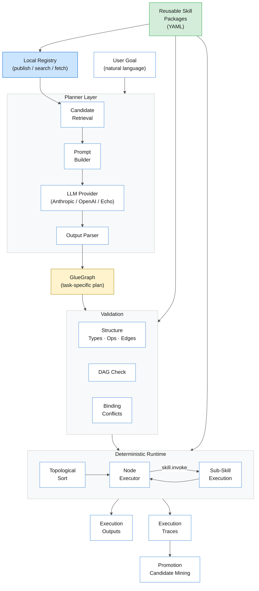

# Graphsmith

**Forge reusable AI skill graphs.**

Graphsmith is a prototype for AI-native skill graphs.

It explores whether LLMs can plan against reusable, typed, executable
graph skills over a deterministic runtime — instead of relying only on
ad hoc code generation or flat tool calls.

No public servers. No API keys required for core functionality.
Everything runs locally. On the current benchmark and holdout task family,
the real Anthropic planner reaches **100% structural pass rate** (24/24 goals).

## Core concepts

| Concept | What it is |
|---------|-----------|
| **SkillGraph** | A reusable, versioned subgraph with typed inputs, outputs, declared effects, and an executable DAG body. Published to the registry. |
| **GlueGraph** | A task-specific composition created by the planner. References published skills via `skill.invoke`. Ephemeral — not automatically published. |
| **Registry** | A local filesystem store where skills are published, searched, and fetched by exact `(id, version)`. |
| **Validator** | Deterministic checks: types, ops, edges, DAG structure, binding conflicts, output completeness. Runs before execution. |
| **Runtime** | Topological executor with a flat value store. Deterministic except for LLM provider output. Supports nested `skill.invoke`. |
| **Planner** | Retrieves candidate skills from the registry, builds a prompt, calls an LLM provider, parses the response into a typed `GlueGraph`. |
| **Traces** | One JSON file per execution. Records node-level timing, inputs, outputs, and nested child traces. |
| **Promotion** | Mines stored traces for repeated op-sequence patterns and flags them as candidates for extraction into reusable skills. |

## How Graphsmith works



See [docs/ARCHITECTURE_DIAGRAM.md](docs/ARCHITECTURE_DIAGRAM.md) for the full diagram set.

## Canonical demo

The full Graphsmith pipeline. Copy-paste to try it.

```bash
pip install -e ".[dev]"
REG=$(mktemp -d)
TRACES=$(mktemp -d)
```

### Step 1: Publish skills

```bash
graphsmith publish examples/skills/text.normalize.v1 --registry "$REG"
graphsmith publish examples/skills/text.extract_keywords.v1 --registry "$REG"
graphsmith publish examples/skills/text.summarize.v1 --registry "$REG"
```

### Step 2: Search the registry

```bash
graphsmith search "text" --registry "$REG"
```

### Step 3: Run a saved multi-skill plan

The repo includes pre-built plans in `examples/plans/` for reproducible demos.

```bash
graphsmith run-plan examples/plans/normalize_extract_keywords.json \
  --input '{"text":"  AI   agents ARE transforming  SOFTWARE  "}' \
  --mock-llm --registry "$REG" --trace-root "$TRACES"
```

Output:
```json
{
  "normalized": "ai agents are transforming software",
  "keywords": "Extract the main keywords...ai agents are transforming software"
}
```

The normalize step cleaned the text. The keyword extraction step sent it to the
(mock) LLM. With a real provider, `keywords` would be e.g. `"AI agents, software"`.

### Step 4: Plan your own workflow

You can also generate plans from natural language:

```bash
graphsmith plan "normalize text" --registry "$REG" --save /tmp/my_plan.json
graphsmith run-plan /tmp/my_plan.json \
  --input '{"text":"hello"}' --mock-llm --registry "$REG"
```

### Step 5: Traces and promotion

Run the plan a few times, then mine for patterns:

```bash
graphsmith run-plan examples/plans/normalize_extract_keywords.json \
  --input '{"text":"second run"}' --mock-llm --registry "$REG" --trace-root "$TRACES"
graphsmith run-plan examples/plans/normalize_extract_keywords.json \
  --input '{"text":"third run"}' --mock-llm --registry "$REG" --trace-root "$TRACES"

graphsmith traces-list --trace-root "$TRACES"
graphsmith promote-candidates --trace-root "$TRACES"
```

### Step 6: Run a skill directly

```bash
graphsmith run examples/skills/text.normalize.v1 \
  --input '{"text":"  AI   agents are transforming SOFTWARE engineering  "}'
```

Output:
```json
{"normalized": "ai agents are transforming software engineering"}
```

### Cleanup

```bash
rm -rf "$REG" "$TRACES"
```

A three-skill plan is also available: `examples/plans/normalize_summarize_keywords.json`.

## Quick start

```bash
pip install -e ".[dev]"

graphsmith version
graphsmith list-ops

# Validate and run a skill
graphsmith validate examples/skills/text.normalize.v1
graphsmith run examples/skills/text.normalize.v1 --input '{"text":"  Hello   World  "}'
# → {"normalized": "hello world"}

# Run a skill with mock LLM
graphsmith run examples/skills/text.summarize.v1 \
  --input '{"text":"Cats sleep a lot","max_sentences":2}' --mock-llm
```

## Visual plan inspector (local, read-only)

```bash
# Launch the local inspector UI in your browser
graphsmith ui

# Or inspect a plan from the command line
graphsmith show-plan examples/plans/normalize_extract_keywords.json
graphsmith render-plan examples/plans/normalize_extract_keywords.json --format mermaid
```

The inspector is a local-only, read-only tool for examining saved plans.
Drag a plan JSON onto the page to see its graph: nodes, edges, inputs, outputs.
Click nodes for details. Export to Mermaid for docs.
No network access, no hosted backend — it is not a full visual editor or web UI.

## LLM providers

```bash
# List available models
export GRAPHSMITH_ANTHROPIC_API_KEY=sk-ant-...
graphsmith list-models --provider anthropic

# Plan with a real LLM
graphsmith plan "normalize and extract keywords" \
  --backend llm --provider anthropic \
  --model claude-haiku-4-5-20251001 --registry "$REG"

# Plan with OpenAI-compatible endpoint
export GRAPHSMITH_OPENAI_API_KEY=sk-...
graphsmith plan "normalize text" \
  --backend llm --provider openai --registry "$REG"
```

Supported: `echo` (test double), `anthropic`, `openai` (compatible with Groq, Ollama, etc.).

## Example skills

| Skill | Description | Effects |
|-------|-------------|---------|
| `text.normalize.v1` | Lowercase, strip, collapse whitespace | pure |
| `text.extract_keywords.v1` | Keyword extraction via LLM | llm_inference |
| `text.summarize.v1` | Text summarization via LLM | llm_inference |
| `json.reshape.v1` | Parse JSON + select fields | pure |
| `text.join_lines.v1` | Format text with keyword prefix | pure |

See [example workflows](docs/EXAMPLE_WORKFLOWS.md) for end-to-end usage.

## CLI commands

| Command | Description |
|---------|-------------|
| `version` | Print version |
| `list-ops` | List primitive ops |
| `list-models` | List provider models |
| `validate <path>` | Validate a skill package |
| `inspect <path>` | Print skill summary |
| `schema <model>` | Export JSON Schema |
| `run <path>` | Run a skill package |
| `publish <path>` | Publish to local registry |
| `search <query>` | Search published skills |
| `show <id>` | Show skill details |
| `plan <goal>` | Plan a glue graph |
| `plan-and-run <goal>` | Plan + execute in one step |
| `run-plan <path>` | Run a saved plan |
| `traces-list` | List stored traces |
| `traces-show <id>` | Show/summarize a trace |
| `traces-prune` | Remove old traces |
| `promote-candidates` | Find repeated patterns |
| `show-plan <path>` | Show plan details (text) |
| `render-plan <path>` | Render plan as Mermaid |
| `ui` | Launch local plan inspector |
| `eval-planner` | Evaluate planner quality |

## Measured planner quality

Graphsmith includes a planner evaluation harness with two goal sets:

| Set | Goals | Latest Anthropic result |
|-----|-------|------------------------|
| Benchmark v1 | 9 | 9/9 = 100% |
| Holdout | 15 | 15/15 = 100% |

```bash
graphsmith eval-planner --goals evaluation/goals --registry "$REG" \
  --backend llm --provider anthropic --model claude-haiku-4-5-20251001
```

See [evaluation/README.md](evaluation/README.md) for benchmark strategy and goal format.

## Current limitations

Graphsmith is a working prototype, not a production system.

**Planning works well on the current task family.** Real LLM planning
(via `--backend llm`) produces valid multi-skill graphs for single-skill,
two-skill, and three-skill compositions across paraphrased goal wordings.
Planning quality on broader or more ambiguous task families has not been
measured yet. Plans can be saved and inspected with `--save-on-failure`.

**Runtime and validation are stable.** The deterministic executor, value
binding semantics, topological sort, and validation checks are well-tested
(530+ tests) and behave predictably.

**Not yet implemented:**
- Public skill registry (everything is local)
- Hosted web UI or visual editor (only a local read-only inspector exists)
- Semantic search (embeddings)
- Distributed execution
- Autonomous skill promotion (candidates are advisory only)
- True parallel execution (`parallel.map` runs sequentially)
- Multi-turn planning or planner self-repair

## Architecture

See [architecture diagram](docs/ARCHITECTURE_DIAGRAM.md) for Mermaid diagrams.

Five layers:
1. **Spec** — package format, Pydantic models, JSON Schema
2. **Runtime** — topological executor, value store, binding semantics
3. **Registry** — local publish/fetch/search with JSON index
4. **Planner** — LLM prompt builder, output parser, glue graph composer
5. **Traces** — persistence, summary, pruning, promotion mining

## Project layout

```
graphsmith/         Python package
  models/           Pydantic models (spec layer)
  parser/           YAML package loader
  validator/        Deterministic validation
  runtime/          Topological executor + value store
  ops/              Primitive op implementations + LLM providers
  registry/         Local file registry + index
  planner/          LLM planner + prompt builder + output parser
  traces/           Trace persistence + promotion mining
  cli/              Typer CLI
tests/              pytest test suite (530+ tests)
examples/skills/    Example skill packages
docs/               Architecture and design docs
```

## Testing

```bash
pytest                    # all unit tests (no network)
pytest -v                 # verbose

# Live provider tests (requires API keys)
GRAPHSMITH_ANTHROPIC_API_KEY=sk-... pytest tests/test_live_providers.py -v
```

## Links

- [Why Graphsmith](docs/WHY_GRAPHSMITH.md) — motivation and research direction
- [Architecture diagram](docs/ARCHITECTURE_DIAGRAM.md)
- [Example workflows](docs/EXAMPLE_WORKFLOWS.md)
- [Evaluation benchmark](evaluation/README.md) — planner quality measurement
- [Binding semantics](docs/BINDING_SEMANTICS.md)
- [Registry semantics](docs/REGISTRY_SEMANTICS.md)
- [Planner semantics](docs/PLANNER_SEMANTICS.md)
- [Changelog](CHANGELOG.md)
- [Contributing](CONTRIBUTING.md)

## License

[MIT](LICENSE)
