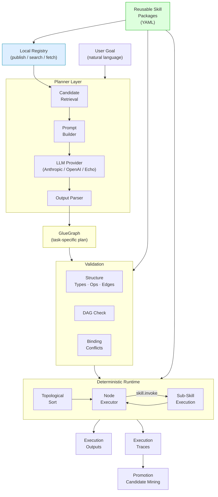
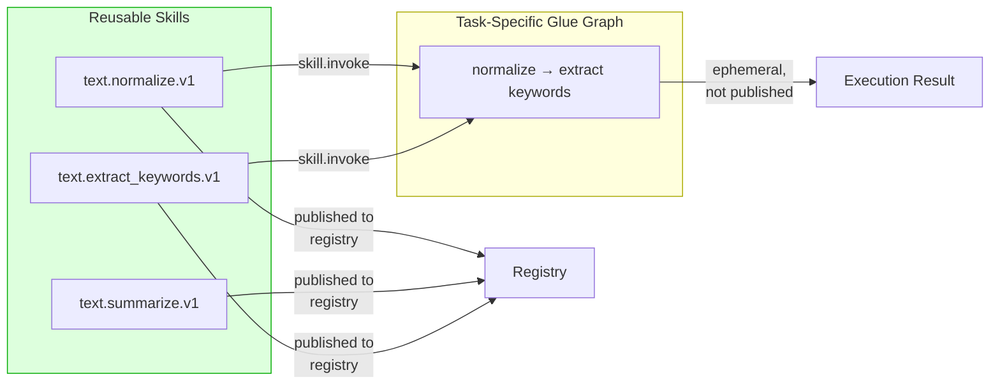
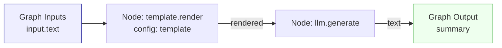

# Graphsmith Architecture

## System overview



## Key distinction: Skills vs Glue Graphs



## Data flow through a skill graph



## Module layout

```
graphsmith/
├── models/      ← Pydantic models (spec layer)
├── parser/      ← YAML package loader
├── validator/   ← Deterministic validation
├── runtime/     ← Topological executor + value store
├── ops/         ← Primitive op implementations + LLM providers
├── registry/    ← Local file registry + index
├── planner/     ← LLM planner + prompt builder + output parser
├── traces/      ← Trace persistence + promotion mining
└── cli/         ← Typer CLI (all commands)
```
